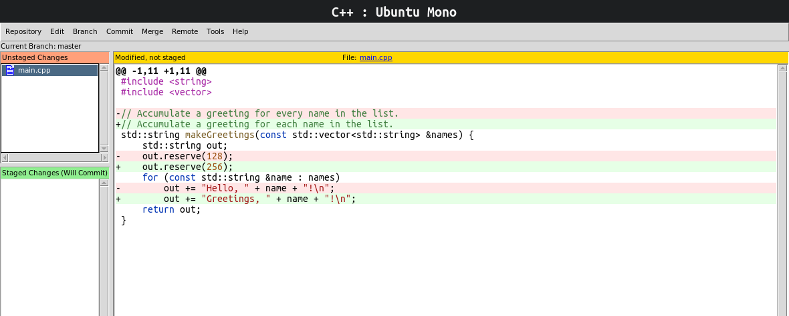
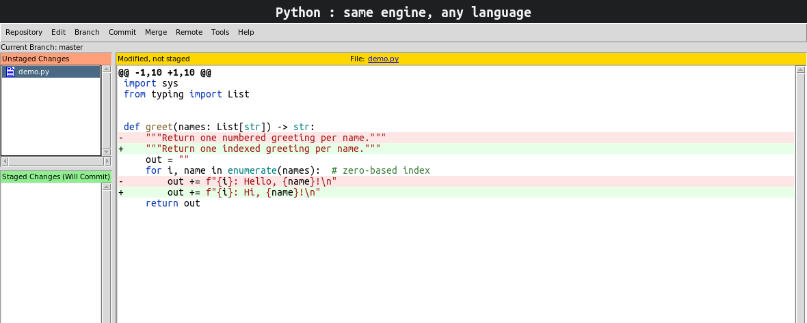
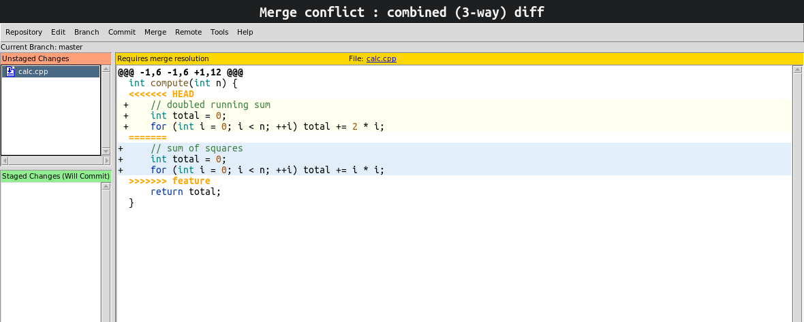
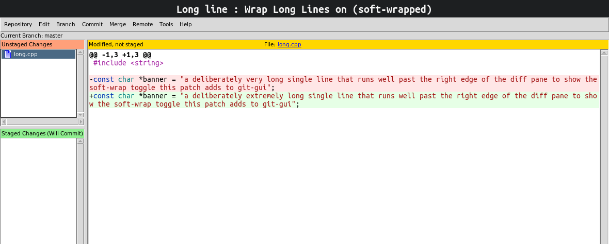
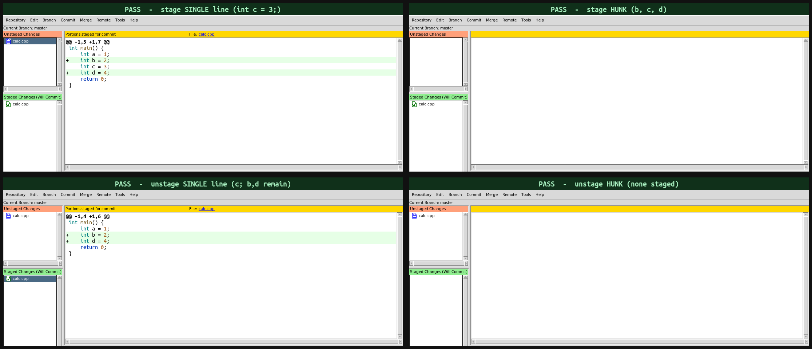
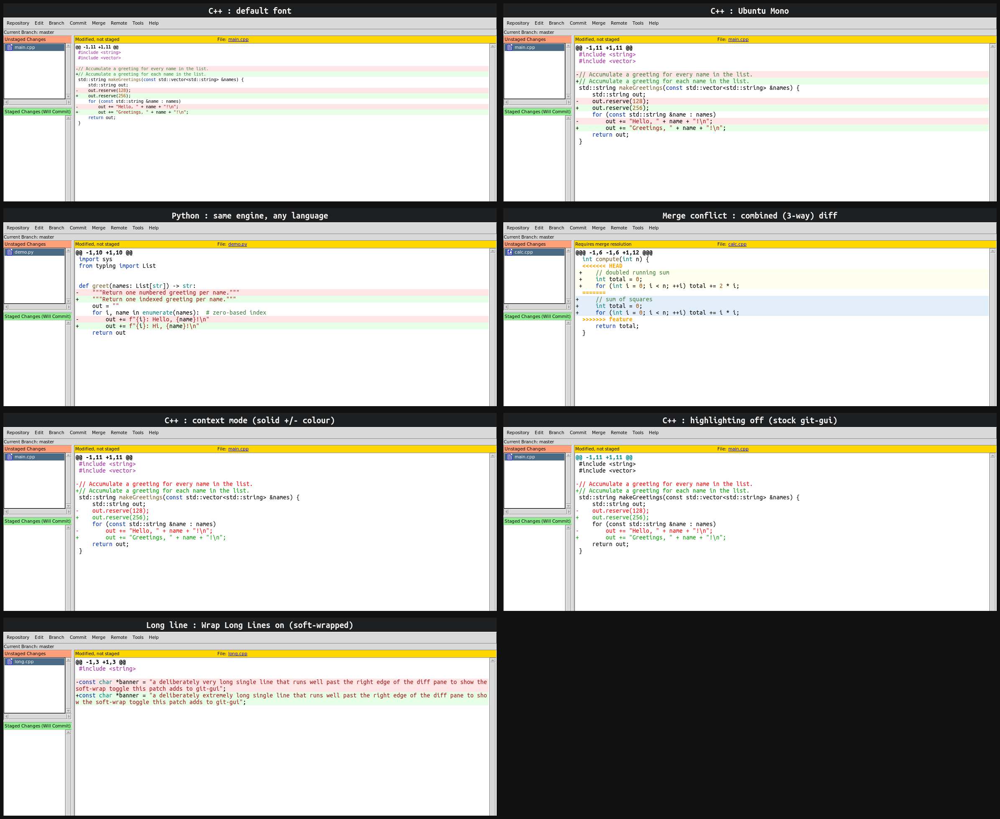

# Diff syntax highlighting for git-gui

Your code, in colour, right in the diff.



git-gui shows you what changed. Now it shows you in the colours you read code in
every day: keywords, types, strings, comments, numbers. Staging works exactly as
it always has, down to the byte.

## Every language

Highlighting comes from [Pygments](https://pygments.org/), kept warm in the
background so it never gets in your way. If Pygments knows the language, the diff
is coloured. C++, Python, and hundreds more, chosen automatically by file name.



## Conflicts, in colour too

Merge conflicts are the diffs you most need to read clearly. They get the full
treatment: each side on its own background, the conflict markers left untouched.



## Long lines, finally readable

A line that used to run off the right edge can soft-wrap instead, on a toggle.



## Your way

Two colour models. Tint gives changed lines a soft background and lets syntax own
the letters. Context keeps the classic green and red on changed lines and colours
the rest. Switch either one, and wrap, live from the diff menu.

## Staging never changes

This is the part that matters. git-gui rebuilds patches from the diff text, and
the highlighting only ever lays colour over that text. Stage a single line or a
whole hunk and the exact same bytes are staged as before. Verified byte for byte,
for staging and unstaging:



## Set it up

It is a git-gui, built the usual way. Beyond a normal git-gui you need git 2.36
or newer (a git-gui baseline) and, for the highlighting, Python 3 with Pygments:

```sh
sudo apt install tcl tk gettext python3-pygments   # build + runtime deps
make                                               # build (generates the lib index and scripts)
sudo make install                                  # install over your system git-gui
```

To try it without installing, run `./git-gui.sh` from the clone after `make`.

Highlighting is on by default. Tune it with `git config`, or live from the diff
context menu:

| Setting | Values | What it does |
| --- | --- | --- |
| `gui.diffsyntax` | `true` · `false` | highlighting on or off |
| `gui.diffsyntaxmode` | `tint` · `context` | the colour model |
| `gui.diffwrap` | `none` · `char` | soft-wrap long lines |

## See every case

Everything above, in one frame:



The [`demo/`](demo/) directory produced every image on this page by driving a real
git-gui in a nested display:

```sh
demo/xephyr-env.sh     # start the test display, once
demo/make-demo.sh      # rebuild the montage
demo/stage-test.sh     # run the stage / unstage byte-exactness suite
```

---

# Git GUI - A graphical user interface for Git

Git GUI allows you to use the [Git source control management
tools](https://git-scm.com/) via a GUI. This includes staging, committing,
adding, pushing, etc. It can also be used as a blame viewer, a tree browser,
and a citool (make exactly one commit before exiting and returning to shell).
More details about Git GUI can be found in its manual page by either running
`man git-gui`, or by visiting the [online manual
page](https://git-scm.com/docs/git-gui).

Git GUI was initially written by Shawn O. Pearce, and is distributed with the
standard Git installation.

# Building and installing

You need to have the following dependencies installed before you begin:

- Git
- Tcl
- Tk
- wish
- Gitk (needed for browsing history)
- msgfmt

Most of Git GUI is written in Tcl, so there is no compilation involved. Still,
some things do need to be done (mostly some substitutions), so you do need to
"build" it.

You can build Git GUI using:

```
make
```

And then install it using:

```
make install
```

You probably need to have root/admin permissions to install.

# Contributing

The project is currently maintained by Johannes Sixt at
https://github.com/j6t/git-gui. Even though the project is hosted at
GitHub, the development does not happen over GitHub Issues and Pull Requests.
Instead, an email based workflow is used. The Git mailing list
[git@vger.kernel.org](mailto:git@vger.kernel.org) is where the patches are
discussed and reviewed.

More information about the Git mailing list and instructions to subscribe can
be found [here](https://git.wiki.kernel.org/index.php/GitCommunity).

## Sending your changes

Since the development happens over email, you need to send in your commits in
text format. Commits can be converted to emails via the two tools provided by
Git: `git-send-email` and `git-format-patch`.

You can use `git-format-patch` to generate patches in mbox format from your
commits that can then be sent via email. Let's say you are working on a branch
called 'foo' that was created on top of 'master'. You can run:

```
git format-patch -o output_dir master..foo
```

to convert all the extra commits in 'foo' into a set of patches saved in the
folder `output_dir`.

If you are sending multiple patches, it is recommended to include a cover
letter. A cover letter is an email explaining in brief what the series is
supposed to do. A cover letter template can be generated by passing
`--cover-letter` to `git-format-patch`.

After you send your patches, you might get a review suggesting some changes.
Make those changes, and re-send your patch(es) in reply to the first patch of
your initial version. Also please mention the version of the patch. This can be
done by passing `-v X` to `git-format-patch`, where 'X' is the version number
of the patch(es).

### Using git-send-email

You can use `git-send-email` to send patches generated via `git-format-patch`.
While you can directly send patches via `git-send-email`, it is recommended
that you first use `git-format-patch` to generate the emails, audit them, and
then send them via `git-send-email`.

A pretty good guide to configuring and using `git-send-email` can be found
[here](https://www.freedesktop.org/wiki/Software/PulseAudio/HowToUseGitSendEmail/).

### Using your email client

If your email client supports sending mbox format emails, you can use
`git-format-patch` to get an mbox file for each commit, and then send them. If
there is more than one patch in the series, then all patches after the first
patch (or the cover letter) need to be sent as replies to the first.
`git-send-email` does this by default.

### Using GitGitGadget

Since some people prefer a GitHub pull request based workflow, they can use
[GitGitGadget](https://gitgitgadget.github.io/) to send in patches. The tool
was originally written for sending patches to the Git project, but it now also
supports sending patches for git-gui.

Instructions for using GitGitGadget to send git-gui patches, courtesy of
Johannes Schindelin:

If you don't already have a fork of the [git/git](https://github.com/git/git)
repo, you need to make one. Then clone your fork:

```
git clone https://github.com/<your-username>/git
```

Then add GitGitGadget as a remote:

```
git remote add gitgitgadget https://github.com/gitgitgadget/git
```

Then fetch the git-gui branch:

```
git fetch gitgitgadget git-gui/master
```

Then create a new branch based on git-gui/master:

```
git checkout -b <your-branch-name> git-gui/master
```

Make whatever commits you need to, push them to your fork, and then head over
to https://github.com/gitgitgadget/git/pulls and open a Pull Request targeting
git-gui/master.

GitGitGadget will welcome you with a (hopefully) helpful message.

## Signing off

You need to sign off your commits before sending them to the list. You can do
that by passing the `-s` option to `git-commit`. You can also use the "Sign
Off" option in Git GUI.

A sign-off is a simple 'Signed-off-by: A U Thor \<author@example.com\>' line at
the end of the commit message, after your explanation of the commit.

A sign-off means that you are legally allowed to send the code, and it serves
as a certificate of origin. More information can be found at
[developercertificate.org](https://developercertificate.org/).

## Responding to review comments

It is quite likely your patches will get review comments. Those comments are
sent on the Git mailing list as replies to your patch, and you will usually be
Cc'ed in those replies.

You are expected to respond by either explaining your code further to convince
the reviewer what you are doing is correct, or acknowledge the comments and
re-send the patches with those comments addressed.

Some tips for those not familiar with communication on a mailing list:

- Use only plain text emails. No HTML at all.
- Wrap lines at around 75 characters.
- Do not send attachments. If you do need to send some files, consider using a
  hosting service, and paste the link in your email.
- Do not [top post](http://www.idallen.com/topposting.html).
- Always "reply all". Keep all correspondents and the list in Cc. If you reply
  directly to a reviewer, and not Cc the list, other people would not be able
  to chime in.
